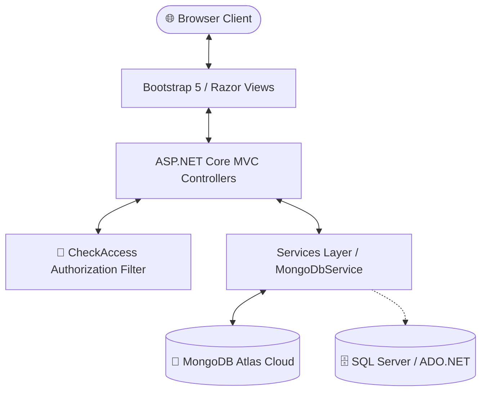

<div align="center">

# 🎓 Student Management System (SMS)
### *A Modern, Enterprise-Grade Academic ERP Portal*

[](https://dotnet.microsoft.com/)
[](https://dotnet.microsoft.com/apps/aspnet/mvc)
[](https://www.mongodb.com/)
[](https://getbootstrap.com/)
[](LICENSE)

<p align="center">
  <b>B.Tech Computer Science & Engineering — Semester 5 (.NET Technologies Project)</b><br>
  <i>Faculty of Engineering and Technology, Marwadi University</i>
</p>

---

</div>

## 📖 Table of Contents
- [📌 Overview & Problem Statement](#-overview--problem-statement)
- [✨ Key Features & Modules](#-key-features--modules)
- [🛠️ System Architecture & Tech Stack](#️-system-architecture--tech-stack)
- [📂 Project Directory Structure](#-project-directory-structure)
- [🗓️ Development Milestones (Day 1 – 35)](#️-development-milestones-day-1--35)
- [🚀 Quick Start & Installation](#-quick-start--installation)
- [🗄️ Database Configuration](#️-database-configuration)
- [🔐 Access Control & Security](#-access-control--security)
- [👥 Team Members & Contributors](#-team-members--contributors)

---

## 📌 Overview & Problem Statement

Academic institutions often face data redundancy, fragmented communication channels, and difficulty in real-time reporting due to legacy, manual record systems.

The **Student Management System (SMS)** is an end-to-end enterprise academic portal engineered with **ASP.NET Core MVC** and **C# 12**. It unifies department administration, course scheduling, classroom logistics, faculty rosters, student admissions, attendance logging, examinations & grades, weekly timetable schedules, campus announcements, and Excel report generation within a single interactive dashboard.

---

## ✨ Key Features & Modules

| Feature | Description |
| :--- | :--- |
| 🛡️ **Session Authentication & Security** | Custom authorization filter (`[CheckAccess]`), password change management, Anti-Forgery Tokens. |
| 🏢 **Department Management** | Full CRUD operations for university faculties, intake capacity, and contact heads. |
| 👨‍🏫 **Faculty & Staff Directory** | Directory tracking academic designations, phone numbers, emails, and department affiliations. |
| 🏫 **Classroom & Lab Allocation** | Monitor facility capacity, room numbers, and laboratory designations. |
| 📚 **Course Catalog** | Manage syllabus codes, credit weights, and course descriptions. |
| 🎓 **Student Lifecycle Tracking** | Manage roll numbers, DOB, contact details, active/dropped states, and drop reasons. |
| 📋 **Attendance Tracking** | Mark and monitor daily student attendance with `Present`, `Absent`, and `Late` indicators. |
| 📊 **Examinations & Grading** | Track student exam marks (Mid-Term, Final, Practical) with automatic Grade computation ($A+, A, B+, B, C, D, F$). |
| 🗓️ **Timetable & Scheduling** | Weekly class timetable linking days, time slots, subjects, rooms, and assigned faculty. |
| 📢 **Notice Board & Announcements** | Publish campus notices with category tags (`Academic`, `Exam`, `Holiday`, `Sports`, `General`). |
| 🤝 **Faculty-Student Advising** | Dynamic mentor-mentee mapping module with active status indicators and progress remarks. |
| 📥 **Data Export (Excel / CSV)** | Export student directories and attendance logs directly into CSV/Excel format. |
| 📈 **Visual Analytics Dashboard** | Real-time counters, status badges, Google Charts for enrollment distribution and attendance ratio. |

---

## 🛠️ System Architecture & Tech Stack



### 💻 Technology Breakdown

- **Backend / Web Layer**: ASP.NET Core MVC (.NET 8.0), C# 12
- **Data Persistence**:
  - **MongoDB Atlas** (Cloud NoSQL via `MongoDB.Driver 2.28.0`)
  - **SQL Server** (`Microsoft.Data.SqlClient 5.2.2` with Stored Procedures)
- **Frontend / Presentation**:
  - HTML5, CSS3, JavaScript (ES6)
  - **Bootstrap 5.3**, **NiceAdmin UI**, **Bootstrap Icons**, **FontAwesome 6**
  - **Google Charts API** & **ApexCharts**

---

## 📂 Project Directory Structure

```text
Student Management System Using dotNET/
├── 📁 Controllers/              # MVC Controllers
│   ├── AuthController.cs        # Login, Logout, Change Password
│   ├── HomeController.cs        # Dashboard & Visual Analytics
│   ├── StudentController.cs     # Student CRUD & CSV Export
│   ├── AttendanceController.cs  # Attendance CRUD & CSV Export
│   ├── MarkController.cs        # Examinations & Grades CRUD
│   ├── TimetableController.cs   # Weekly Schedule CRUD
│   ├── NoticeController.cs      # Campus Announcements CRUD
│   ├── StaffController.cs       # Faculty Directory CRUD
│   ├── CourseController.cs      # Course Catalog CRUD
│   ├── DepartmentController.cs  # Department CRUD
│   ├── ClassroomController.cs   # Classroom Allocation CRUD
│   └── EnrollmentController.cs  # Advising & Mentorship CRUD
├── 📁 Models/                   # Data Models & ViewModels
│   ├── Student.cs
│   ├── Attendance.cs
│   ├── Mark.cs
│   ├── Timetable.cs
│   ├── Notice.cs
│   ├── Staff.cs
│   ├── Course.cs
│   ├── Department.cs
│   ├── Classroom.cs
│   ├── Enrollment.cs
│   ├── UserLoginModel.cs
│   └── ChangePasswordModel.cs
├── 📁 Views/                    # Razor View Templates (.cshtml)
│   ├── 📁 Auth/                 # Login & Change Password Views
│   ├── 📁 Home/                 # Interactive Dashboard & Analytics
│   ├── 📁 Student/              # Student List & Add/Edit Forms
│   ├── 📁 Attendance/           # Attendance Records & Form
│   ├── 📁 Mark/                 # Examination Marks & Grades
│   ├── 📁 Timetable/            # Timetable Schedules & Form
│   ├── 📁 Notice/               # Campus Notice Board
│   ├── 📁 Staff/                # Faculty Directory & Form
│   ├── 📁 Course/               # Course Management Views
│   ├── 📁 Department/           # Department Management Views
│   ├── 📁 Classroom/            # Classroom Allocation Views
│   ├── 📁 Enrollment/           # Student-Faculty Advising Views
│   └── 📁 Shared/               # _Layout, Navbar, Sidebar & Partials
├── 📁 Filters/                  # Custom Authorization (CheckAccess.cs)
├── 📁 Services/                 # MongoDB Database Layer & Seed Engine (MongoDbService.cs)
├── 📁 wwwroot/                  # Static Assets (CSS, JS, Vendor Libraries, Images)
├── 📄 appsettings.json          # Configuration & Connection Strings
├── 📄 Program.cs                # Application Startup & Middleware Pipeline
├── 📄 StudentManagementSystem.csproj
└── 📄 README.md
```

---

## 🗓️ Development Milestones (Day 1 – 35)

- **Day 1–6**: Project initialization, layout scaffolding, navbar, sidebar, configuration, error handling.
- **Day 7–9**: CSS design, UI interactivity, JavaScript enhancements, frontend vendor libraries.
- **Day 10–12**: Authentication models, login controller, session management, access control filter.
- **Day 13–16**: Academic models (Department, Course, Classroom, Staff, Student, Enrollment) & MongoDB service.
- **Day 17–23**: Core Controllers & CRUD views (Home, Department, Course, Classroom, Staff, Student, Enrollment).
- **Day 24–26**: Assets, media, vendor library setup, documentation.
- **Day 27**: Attendance Module (Model, Controller, Views, and MongoDB Seed Data).
- **Day 28**: Examinations & Grades Module with auto-grading engine.
- **Day 29**: Notice Board & Campus Announcements Module.
- **Day 30**: Weekly Timetable & Class Schedule Module.
- **Day 31**: Dashboard upgrade with live analytics, donut charts, and recent activity tickers.
- **Day 32**: Account security & Change Password module.
- **Day 33**: Categorized sidebar navigation overhaul with UI polish.
- **Day 34**: CSV & Excel Data Export functionality for Students and Attendance records.
- **Day 35**: Comprehensive project documentation, final verification, and completion.

---

## 🚀 Quick Start & Installation

### 📋 Prerequisites
- [.NET 8.0 SDK](https://dotnet.microsoft.com/download/dotnet/8.0) or higher
- [Visual Studio 2022](https://visualstudio.microsoft.com/) / [VS Code](https://code.visualstudio.com/) / JetBrains Rider
- Active Internet Connection (for MongoDB Atlas cloud connection)

### ⚙️ Step-by-Step Setup

1. **Clone the Repository**
   ```bash
   git clone https://github.com/mitulaghara/Student-Management-System.git
   cd "Student Management System Using dotNET"
   ```

2. **Restore Dependencies & Build**
   ```bash
   dotnet restore
   dotnet build
   ```

3. **Run the Application**
   ```bash
   dotnet run
   ```

4. **Open in Browser**
   Navigate to: `http://localhost:5062`

---

## 🗄️ Database Configuration

### Option A: MongoDB Atlas (Default & Cloud-Ready)
The application connects automatically to MongoDB Atlas using the configured connection string in `appsettings.json`. Database collections and seed records are automatically initialized on the first application launch.

```json
"MongoDbSettings": {
  "ConnectionString": "mongodb+srv://<username>:<password>@cluster.mongodb.net/?retryWrites=true&w=majority",
  "DatabaseName": "StudentManagementDB"
}
```

### Option B: Microsoft SQL Server (ADO.NET Stored Procedures)
1. Execute `StudentManagementSystem.sql` in SQL Server Management Studio (SSMS) to create the schema and stored procedures.
2. Update the `DefaultConnection` string in `appsettings.json`.

---

## 🔐 Access Control & Security

- **Default Administrator Credentials**:
  - **Username**: `admin`
  - **Password**: `admin123`
- **Route Guarding**: All operational modules are protected using the `[CheckAccess]` action filter.
- **CSRF Mitigation**: HTML forms utilize ASP.NET Core built-in Anti-Forgery Tokens (`@Html.AntiForgeryToken()`).
- **Profile Security**: Change Password feature available directly under admin profile dropdown.

---

## 👥 Team Members & Contributors

| Name | Role | GitHub Profile |
| :--- | :--- | :--- |
| **Mitul Aghara** | Lead Developer & Architect | [@mitulaghara](https://github.com/mitulaghara) |
| **Krisha** | Core Contributor | [@Krisha15607](https://github.com/Krisha15607) |
| **Harsh Zolapara** | Core Contributor | [@harshzolapara144295-dotcom](https://github.com/harshzolapara144295-dotcom) |

### 🏛️ Institution
- **Marwadi University** — *Faculty of Engineering and Technology (Department of Computer Engineering)*

---

<div align="center">
  <sub>© 2026 <b>Student Management System</b>. Built for .NET Technologies Academic Project.</sub>
</div>
